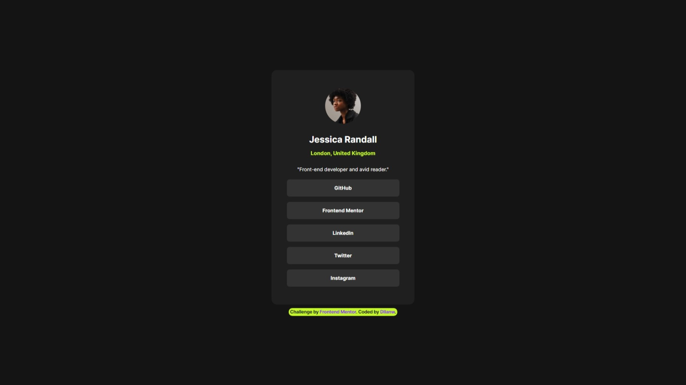

# Frontend Mentor - Social links profile solution

This is a solution to the [Social links profile challenge on Frontend Mentor](https://www.frontendmentor.io/challenges/social-links-profile-UG32l9m6dQ). Frontend Mentor challenges help you improve your coding skills by building realistic projects. 

##  Table of contents

- [Frontend Mentor - Social links profile solution](#frontend-mentor---social-links-profile-solution)
  - [Table of contents](#table-of-contents)
  - [⭐ Overview](#-overview)
    - [The challenge](#the-challenge)
    - [Screenshot](#screenshot)
    - [Links](#links)
  - [⭐ My process](#-my-process)
    - [Built with](#built-with)
    - [What I learned](#what-i-learned)
  - [⭐Author](#author)

**Note: Delete this note and update the table of contents based on what sections you keep.**

## ⭐ Overview

### The challenge

Users should be able to:

- See hover and focus states for all interactive elements on the page

### Screenshot



### Links

- Solution URL: [GitHub](https://github.com/Dllanw/social-links-profile-main)
- Live Site URL: [Add live site URL here](https://your-live-site-url.com)

## ⭐ My process

### Built with

- Semantic HTML5 markup
- CSS custom properties
- Flexbox
- CSS Grid
- @media

### What I learned

- I learned to use the ```<section>``` tag correctly.
  
- I learned how to import fonts directly in CSS.
```html
<section>
    <div>
    </div>
</section>
```
```css
@import
:root {
    /////
}
```

## ⭐Author

- 🌱 Website - **in process**
- 🌱 Frontend Mentor - [@Dllanw](https://www.frontendmentor.io/profile/Dllanw)

